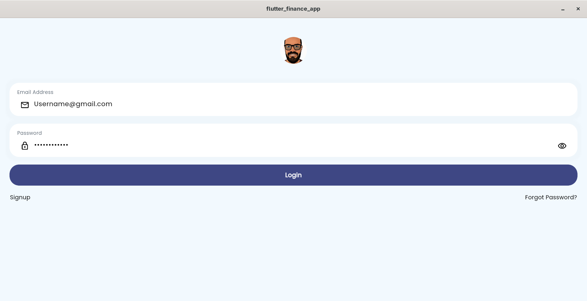
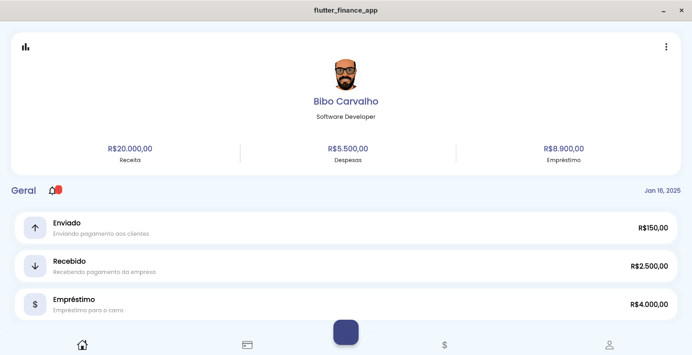

# 💰 Financify - Aplicativo de Gestão Financeira

<div align="center">
  
  
</div>

<div align="center">
  
[](https://flutter.dev)
[](https://dart.dev)
[](https://opensource.org/licenses/MIT)
[](https://github.com/seu-usuario/flutter-finance-app/stargazers)

</div>

## 📌 Visão Geral

O Financify é um aplicativo de gestão financeira pessoal desenvolvido em Flutter que ajuda usuários a controlarem seus gastos, receitas e investimentos de forma intuitiva e eficiente.

## ✨ Funcionalidades

### 📱 Principais Recursos
- **Dashboard Financeiro Completo**
- **Registro de Transações** (Receitas e Despesas)
- **Categorização Automática**
- **Relatórios e Gráficos**
- **Backup na Nuvem**

### 🛠️ Tecnologias Utilizadas
| Tecnologia | Descrição |
|------------|-----------|
| Flutter | Framework multiplataforma |
| Dart | Linguagem de programação |
| Hive | Banco de dados local |
| GetX | Gerenciamento de estado |
| ChartJS | Visualização de gráficos |

## 🎨 Telas do Aplicativo

<div align="center">
  
  
</div>

## 🚀 Começando

### Pré-requisitos
- Flutter SDK (>=3.19.0)
- Dart (>=3.3.0)
- Dispositivo/Emulador Android/iOS

### Instalação
1. Clone o repositório:
```bash
git clone https://github.com/seu-usuario/flutter-finance-app.git
```

2. Acesse o diretório:
```bash
cd flutter-finance-app
```

3. Instale as dependências:
```bash
flutter pub get
```

4. Execute o app:
```bash
flutter run
```

## 📂 Estrutura do Projeto
```
lib/
├── assets/
│   ├── images/
│   │   ├── logo.png
│   │   └── background.jpg
├── controllers/
├── models/
├── pages/
│   ├── auth/
│   │   ├── login_page.dart
│   │   └── register_page.dart
│   ├── home/
│   │   ├── dashboard.dart
│   │   └── reports.dart
│   └── transactions/
│       ├── add_transaction.dart
│       └── list_transactions.dart
├── services/
├── theme/
│   ├── app_colors.dart
│   └── app_text.dart
└── main.dart
```

## 🤝 Como Contribuir

1. Faça um **fork** do projeto
2. Crie uma branch (`git checkout -b feature/nova-funcionalidade`)
3. Commit suas alterações (`git commit -m 'Adiciona nova funcionalidade'`)
4. Push para a branch (`git push origin feature/nova-funcionalidade`)
5. Abra um **Pull Request**

## 📄 Licença

Este projeto está licenciado sob a licença MIT - veja o arquivo [LICENSE](LICENSE) para detalhes.

## 📧 Contato

**Desenvolvedor**: Seu Nome  
**Email**: seu-email@exemplo.com  
**LinkedIn**: [Perfil LinkedIn](https://linkedin.com/in/seu-perfil)  

<div align="center">
  Feito com ❤️ por <a href="https://github.com/seu-usuario">Seu Nome</a>
</div>